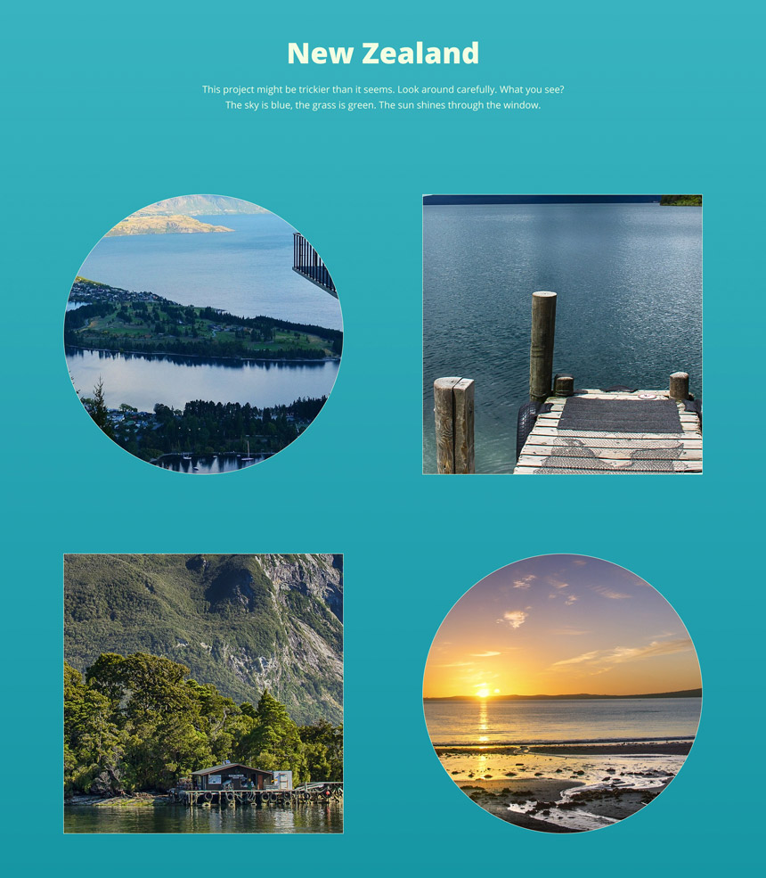

Front-end / WordPress Test Project
======================

## Project brief
Convert the following designs to HTML5 / CSS3 / JavaScript  / WordPress.

### Thumbnails

### Overlay

## Requirements
1. Create project using new version of our custom development tool [Chisel](https://github.com/xfiveco/generator-chisel/issues/465). Check out the [documentation](https://rewrite-with-webpack-docs--getchisel.netlify.app/docs) for the new version.
1. Convert design and make it responsive so it looks and works nice. The 1920px resolution of the design is a reference resolution we compare your conversion to.
1. Create a hover effect for the image thumbnails.
1. Create a simple custom overlay for photos *using JavaScript*. You can use an external vanilla JavaScript library for it. Don't use jQuery and jQuery plugins.
1. Allow to choose thumbnail shape from the 2 predefined shapes (circle, square) in the WordPress admin and enter enough sample images to demonstrate the effect.
1. Set up a virtual host with your project repository name (eg. `yourname-fewp-test.test`) so we don't have search & replace URLs when testing your project.
1. Store the whole WordPress installation into the test repository. Store a database dump to it as well and a zip with `upload` folder with images used in the project.
1. Commit the initial files after Chisel setup separately. Continue committing in small logical steps so we can track down your changes.

## Design
Design is available in [Figma](https://www.figma.com/) at https://www.figma.com/file/XmLxW928QcDblZul5dGpLM/Xfive-Gallery-Test. If you haven't already, sign up for a free Figma account, so you can work with the design.

The following images are used in the design:
 -  https://pixabay.com/en/new-zealand-lake-mountain-landscape-679068/
 -  https://pixabay.com/en/new-zealand-lake-web-kai-dock-583176/
 -  https://pixabay.com/en/new-zealand-doubtful-sound-fjord-583181/
 -  https://pixabay.com/en/sun-rise-beach-new-zealand-auckland-661541/

## Supported browsers
Ensure that the elements work and display correctly in the following browsers:

- Google Chrome (latest version)
- Firefox (latest version)
- Microsoft Edge

## Coding Standards
When working on the project use consistent coding style. Try to follow what's already in Chisel - EditorConfig, stylelint, ESLint (see [Code Quality](https://www.getchisel.co/docs/development/code-quality/)), [ITCSS](https://www.getchisel.co/docs/development/itcss/), WordPress code organization, etc. Remove or replace default styles which are not needed.

## Project Deadline
Deliver project within 1 week time.

## Quality Assurance

What you need to do to get high QA score? Simply answer **Yes** to all these questions:

### General

- Are all requirements set above met?
- Is the page working without any JS errors?

### Precision

- Is reasonable precision achieved?

### Browser check

- Does page display and work correctly in supported browsers?

### Valid HTML

- Is the page valid?

### Semantic Markup

- Are the correct tags being used?

### Coding Standards

- Is the page using a consistent HTML coding style?
- Is the page using a consistent CSS coding style?
- Is the page using a consistent JS coding style?

### Optimization

- Are image files sufficiently compressed?
- Is CSS and JS concatenated and minified?

### Accessibility

- Are proper ALT attributes for images provided?
- Are ARIA attributes properly used?
- Is proper heading structure in place?
